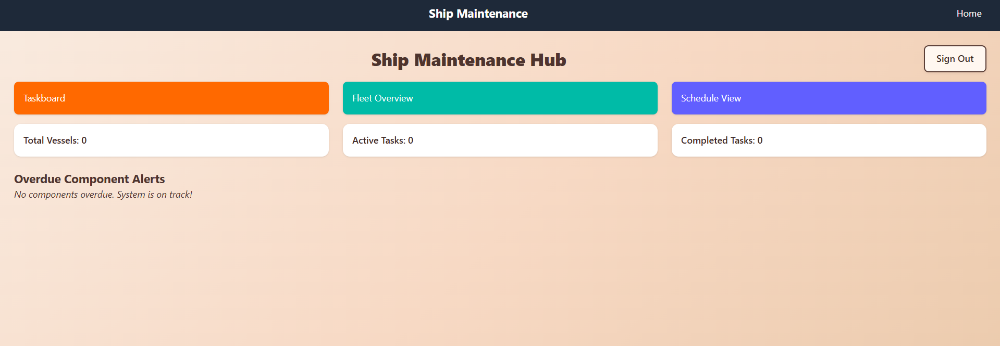
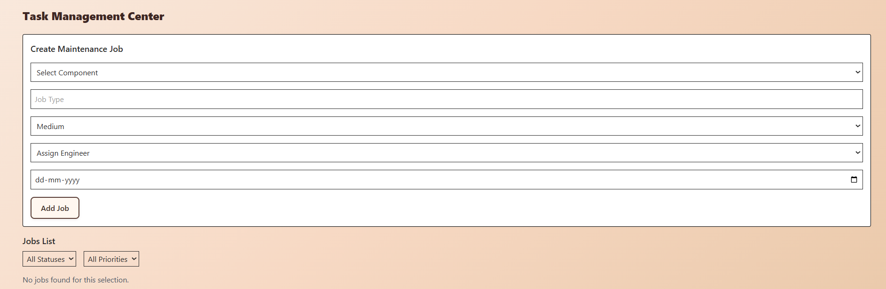

# Ship Maintenance Dashboard

## About the Application

The Ship Maintenance Dashboard is a comprehensive web application designed to streamline and manage ship maintenance operations. It provides an intuitive interface for users to track jobs, manage ships and their components, and schedule maintenance tasks efficiently. The application is tailored for ship maintenance teams, engineers, and administrators to ensure smooth operations and timely maintenance.

## Features

- **User Authentication**: Secure login system for different roles (Admin, Inspector, Engineer).
- **Dashboard**: Overview of key performance indicators (KPIs) such as total ships, jobs in progress, and completed jobs.
- **Job Management**: Create, edit, and track maintenance jobs with priority and status.
- **Ship Management**: Add, edit, and view details of ships and their components.
- **Component Management**: Manage components associated with ships and track their maintenance status.
- **Calendar View**: Visualize scheduled jobs and maintenance tasks on a calendar.
- **Notifications**: Receive alerts for job updates and overdue maintenance tasks.

## How to Run the Application

Follow these steps to set up and run the application locally:

1. **Clone the Repository**:

   ```bash
   git clone <repository-url>
   cd Dashboard-Ship_Maintenance
   ```

2. **Navigate to the Frontend Directory**:

   ```bash
   cd Frontend
   ```

3. **Install Dependencies**:
   Ensure you have Node.js installed, then run:

   ```bash
   npm install
   ```

4. **Start the Development Server**:

   ```bash
   npm run dev
   ```

   The application will be available at `http://localhost:5173`.

5. **Build for Production**:
   To create a production build, run:

   ```bash
   npm run build
   ```

6. **Preview the Production Build**:
   ```bash
   npm run preview
   ```

## Important Note for Testing Roles

When testing the application with different roles (Admin, Inspector, Engineer), ensure you open a **new browser window** or use **incognito/private browsing mode** for each role. This is necessary because the application uses local storage for session management, and using the same browser window can cause conflicts between roles.

## Login Details

To access the application, use the following credentials based on your role:

### Admin

- **Name**: Admin
- **Email**: admin@entnt.in
- **Password**: admin123

### Inspector

- **Name**: Engineer
- **Email**: inspector@entnt.in
- **Password**: inspect123

### Engineer

- **Name**: Inspector
- **Email**: engineer@entnt.in
- **Password**: engine123

## Screenshots

Below are some screenshots of the application:

### Login Page


### Dashboard



### Component Page


### Calendar


### Ships Page


### Jobs Page



---

Feel free to explore the application and provide feedback!
